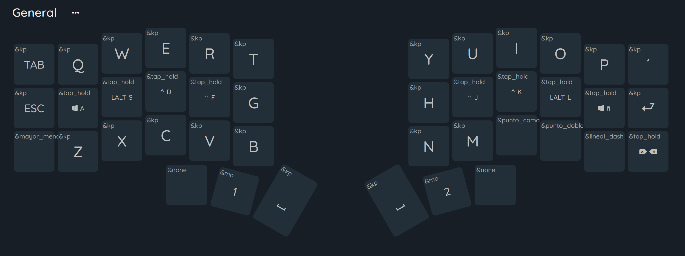
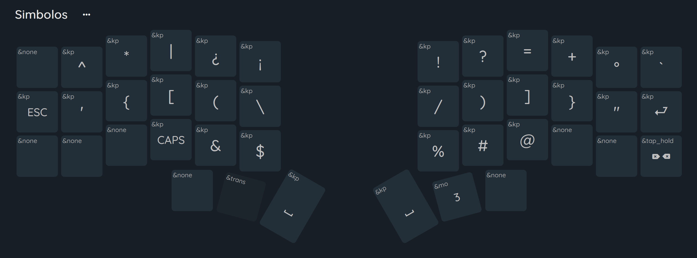
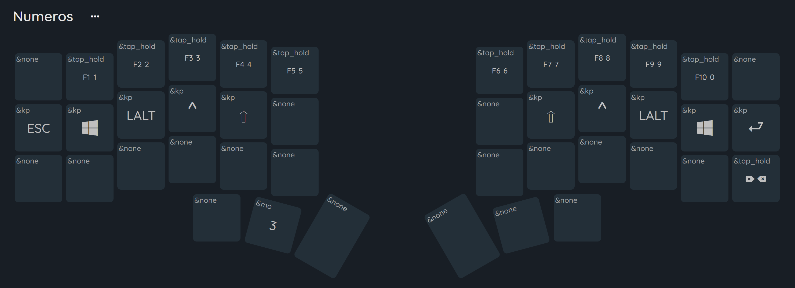
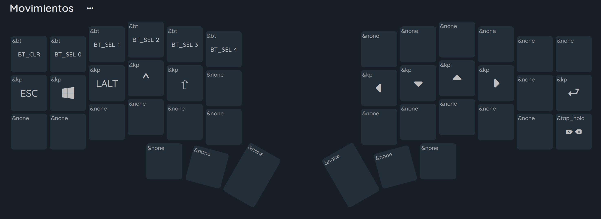

# Configuración de teclado
---
Esta configuración tiene varias teclas en español directamente, y para crear el archivo por si se necesita otro teclado, estoy usando [zmk-locale-generator](https://github.com/joelspadin/zmk-locale-generator).

La configuración actual esta dada por las siguientes capas

Lower:

Upper:

Extra:
